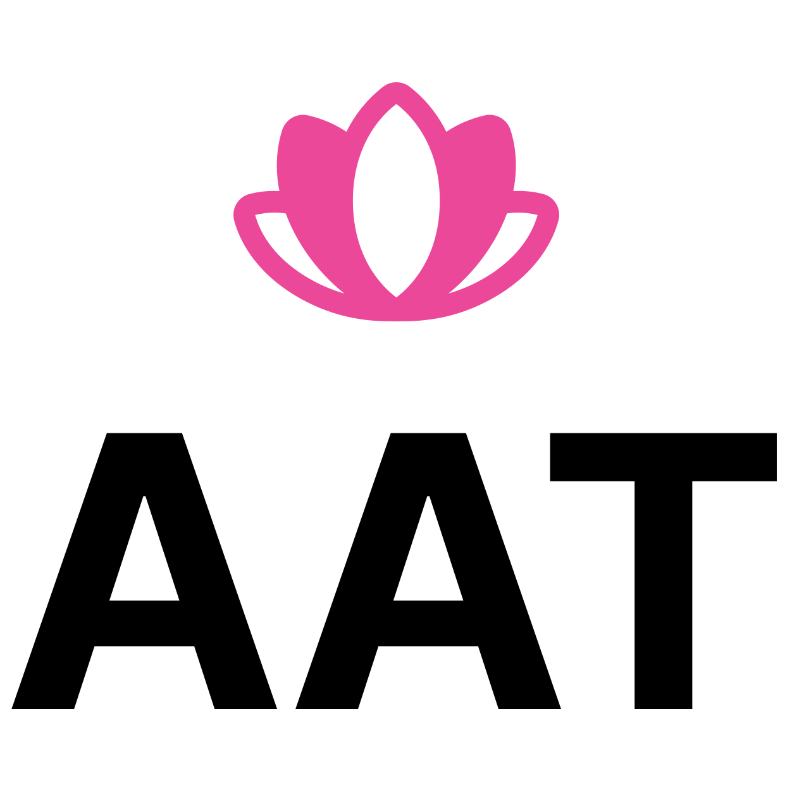

<div align="center">
  
  
  [](https://www.gnu.org/licenses/gpl-3.0)
  [](https://github.com/alvinunreal/anxiety-aid-tools/discussions)
  [](https://github.com/alvinunreal/anxiety-aid-tools/stargazers)
  
  **[Visit anxietyaidtools.com](https://anxietyaidtools.com)**
  
  *Open Source Wellness Tools*
</div>

## About

Anxiety Aid Tools is an open-source collection of interactive exercises designed to provide support during moments of anxiety. Built with accessibility and simplicity in mind, this platform offers techniques based on established therapeutic practices.

## Available Exercises

| Exercise | Duration | Description |
|----------|----------|-------------|
| **2-Minute Breathing** | 2-3 min | Quick breathing exercises to help you feel calmer and more centered |
| **5-4-3-2-1 Grounding** | 3-5 min | Notice 5 things you see, 4 you can touch, 3 you hear, 2 you smell, 1 you taste to reconnect with the present |
| **Guided Breathing** | 5-10 min | Follow along with breathing patterns designed to reduce stress and anxiety |
| **Progressive Muscle Relaxation** | 8-12 min | Tense and release different muscle groups to melt away physical stress |
| **Peaceful Visualization** | 10-12 min | Imagine yourself in calm, soothing places to quiet your mind |
| **Thought Labeling** | 5-15 min | Learn to observe anxious thoughts without getting caught up in them |
| **Stress Relief Bubbles** | 2-5 min | Pop virtual bubbles to distract your mind and release nervous energy |
| **Sound Therapy** | 5-30 min | Calming sounds and frequencies to help your mind and body relax |

## Internationalization

The platform aims to support multiple languages. Currently available in English, with i18n being prepared for additional languages.

## Tech Stack

- **Framework**: Nuxt 3
- **Styling**: Tailwind CSS
- **3D Graphics**: Three.js
- **Hosting**: Cloudflare Pages

## Contributing

**We need your help to make anxiety relief more accessible worldwide!**

This project is in its early stages and welcomes contributions of all kinds. Here are some ways you can help:

### Add Translation Support

Help make these tools available in more languages:
- Check existing translations in `i18n/locales/en/`
- Copy the English files for your target language
- Translate exercise names, descriptions, and UI text
- Test your translations locally

### Create New Exercises

Have an idea for a new anxiety relief technique?
- Study existing exercises in the `components/` directory
- Follow established patterns for exercise flow
- Include appropriate timing and guidance
- Add i18n support for your new exercise

### Improve Existing Exercises

- Enhance user experience and accessibility
- Improve visual design and animations
- Optimize performance

### Improve Accessibility

Help make these tools usable for everyone:
- Add keyboard navigation support
- Implement screen reader compatibility
- Improve color contrast and visual indicators
- Add alternative text for images and icons
- Test with assistive technologies
- Follow WCAG guidelines for web accessibility

## Development Setup

1. **Clone the repository**
   ```bash
   git clone https://github.com/alvinunreal/anxiety-aid-tools.git
   cd anxiety-aid-tools
   ```

2. **Install dependencies**
   ```bash
   pnpm install
   ```

3. **Start development server**
   ```bash
   pnpm dev
   ```

4. **Build for production**
   ```bash
   pnpm build
   ```

## Project Structure

```
├── components/           # Exercise components
│   ├── BreathingExercise.vue
│   ├── GroundingExercise.vue
│   └── ...
├── pages/               # Route pages for each exercise
├── i18n/
│   └── locales/
│       └── en/          # English translations
│           ├── exercises.json
│           ├── techniques.json
│           └── ...
├── assets/css/          # Global styles
├── public/              # Static assets
└── composables/         # Vue composables
```

## Community & Support

- **Discussions**: [GitHub Discussions](https://github.com/alvinunreal/anxiety-aid-tools/discussions) - Share ideas, ask questions, get help
- **Issues**: [GitHub Issues](https://github.com/alvinunreal/anxiety-aid-tools/issues) - Report bugs or request features
- **Pull Requests**: [GitHub PRs](https://github.com/alvinunreal/anxiety-aid-tools/pulls) - Submit your contributions

## License

This project is open source and available under the [GPL v3 License](LICENSE).

## Acknowledgments

- Built with ❤️ by [Alvin](https://github.com/alvinunreal) at Boring Dystopia Development
- Anxiety relief techniques based on established therapeutic practices
- Community contributors who help make mental health resources more accessible

---

<div align="center">
  
**Help us make anxiety relief accessible to everyone**
  
[Contribute](https://github.com/alvinunreal/anxiety-aid-tools/blob/main/README.md#-contributing) • [Discuss Ideas](https://github.com/alvinunreal/anxiety-aid-tools/discussions) • [Report Issues](https://github.com/alvinunreal/anxiety-aid-tools/issues) • [Visit Website](https://anxietyaidtools.com)

</div>